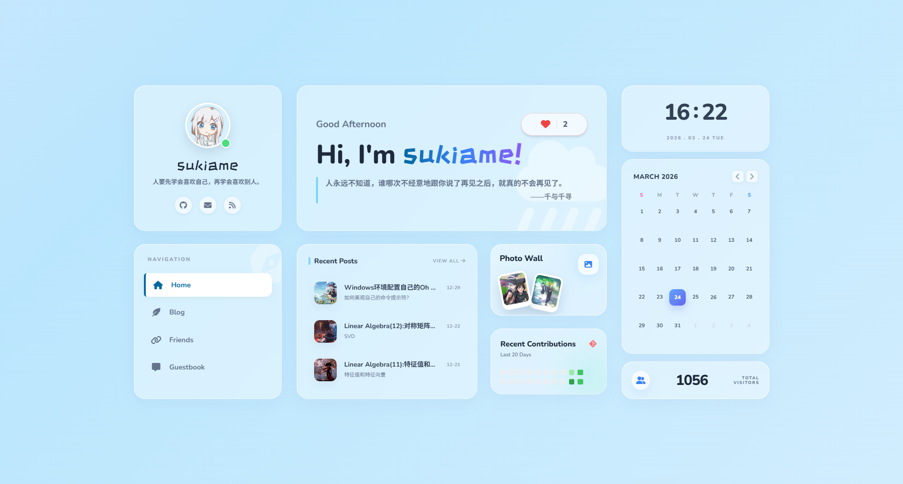

# SukiAme

[English](README.md) | [简体中文](README.zh-CN.md)



SukiAme 是一个柔和玻璃拟态风格的 Hexo 主题，包含 bento 风格首页、页面切换动画、整合式博客归档页、友情链接页、照片墙和便签留言板。

这个仓库是主题本体，不是完整的 Hexo 博客备份。不过它同时内置了一套可直接使用的默认内容和链接，因此新装后就能得到一个相对完整的展示效果。当前默认配置会保留作者的 GitHub、邮箱、南开 VPN 和 Coze 链接，作为主题自带的示例数据。

## 功能特性

- Bento 风格首页，包含头像、导航、最新文章、GitHub 活跃度、照片预览、时钟、日历、访客卡片和点赞按钮
- 统一的博客归档布局，覆盖 archives、categories 和 tags 页面
- 独立的文章页、友链页、留言板页和照片墙页布局
- 带预取的页面切换动画
- 文章页悬浮目录
- 增强代码块，支持复制、折叠、自动换行和可选全屏查看
- 支持行内和块级 KaTeX 数学公式渲染
- 内置 Atom 订阅源生成器，输出到 `/atom.xml`
- 可选的 GitHub 活跃度同步，使用 `GITHUB_TOKEN`
- 可选的 Busuanzi 访客计数
- 可选的首页点赞接口和留言板远程接口

## 环境要求

- Node.js 和 npm
- Hexo `^8.0.0`
- 站点已启用 `hexo-renderer-ejs`

## 安装步骤

### 1. 安装 Hexo 并初始化站点

```bash
npm install -g hexo-cli
hexo init my-blog
cd my-blog
npm install
```

### 2. 添加主题

将本仓库复制或克隆到你的 Hexo 站点 `themes/sukiame` 目录下。

示例：

```bash
git clone <your-theme-repo-url> themes/sukiame
```

### 3. 安装主题依赖

这个主题依赖 `katex`，所以还需要安装主题目录下 `package.json` 声明的依赖：

```bash
npm install --prefix themes/sukiame
```

你也可以手动进入 `themes/sukiame` 后执行 `npm install`。

### 4. 安装常见 Hexo 插件

如果你的站点里还没有这些包，可以安装：

```bash
npm install hexo-generator-archive hexo-generator-category hexo-generator-index hexo-generator-tag hexo-renderer-ejs hexo-renderer-marked
```

### 5. 启用主题

在站点根目录的 `_config.yml` 中设置：

```yaml
theme: sukiame
```

### 6. 配置主题

主题默认配置位于 `themes/sukiame/_config.yml`。

你可以选择：

- 直接修改 `themes/sukiame/_config.yml`
- 在站点根目录创建 `_config.sukiame.yml`，通过覆盖配置的方式自定义，而不直接改动主题文件

### 7. 部署前检查 favicon 路径

当前示例配置中的 `favicon` 指向 `/images/favicon.ico`。部署前请确认这个文件存在，或者改成仓库里真实存在的图片路径。

## 内置页面与路由

这个主题已经在自身 `source/` 目录中内置了默认页面，因此新安装后即可直接生成以下路由：

- `/`
- `/archives/`
- `/categories/`
- `/tags/`
- `/friends/`
- `/guestbook/`
- `/photo-wall/`
- `/atom.xml`

也就是说，默认情况下你不需要额外执行 `hexo new page friends`、`guestbook` 或 `photo-wall` 才能使用这些页面。

## 主题配置项

当前 `_config.yml` 中主要实际使用的配置段包括：

- `avatar`
- `favicon`
- `menu`
- `social`
- `github`
- `activity`
- `visitor_counter`
- `home_like`
- `photo_wall`
- `guestbook`
- `friends`
- `code_blocks`

主题默认数据包含：

- `social` 中作者默认的 GitHub 和邮箱链接
- 示例 GitHub 活跃度配置
- 示例友链卡片、留言板便签和照片墙数据
- 示例首页点赞配置

## 可选动态功能

### GitHub 活跃度

如果你希望在 `hexo generate` 时拉取实时 GitHub contribution 数据，需要先设置环境变量，并在主题配置中填写用户名。

PowerShell：

```powershell
$env:GITHUB_TOKEN="your_github_token"
hexo generate
```

Bash：

```bash
GITHUB_TOKEN=your_github_token hexo generate
```

主题配置示例：

```yaml
github:
  username: your-github-name
  days: 20
```

如果没有提供 token，或者请求失败，主题会回退到 `activity.cells` 中配置的静态数据。

### 首页点赞接口

首页点赞按钮使用 `home_like.endpoint` 配置。当前默认值是：

```yaml
home_like:
  endpoint: /api/like/home-hero
```

接口预期行为：

- `GET /api/like/home-hero` 返回类似 `{ "count": 123 }`
- `POST /api/like/home-hero` 返回类似 `{ "count": 124 }`

如果这个接口不存在，首页仍然可以正常渲染，并显示配置里的基础点赞数，但实时同步和远程点赞提交不会生效。

### 留言板接口

留言板页面会通过以下接口加载和提交便签：

- `GET /api/guestbook/notes`
- `POST /api/guestbook/notes`

便签数据预期结构：

```json
{
  "id": 1,
  "author": "SukiAme",
  "date": "2026.03.24",
  "message": "Hello",
  "tone": "blue"
}
```

如果接口不可用，页面依然会显示 `guestbook.items` 中配置的默认便签，但远程提交留言会失败。

### 访客计数

Busuanzi 默认关闭。

启用方式：

```yaml
visitor_counter:
  enable: true
  provider: busuanzi
  metric: site_uv
  label: TOTAL VISITORS
  placeholder: --
```

支持的统计字段：

- `site_uv`
- `site_pv`

## 说明

- 主布局中使用了 CDN 版 Tailwind CSS、Font Awesome 和 Google Fonts
- 生成站点时会把 KaTeX 的 CSS 和字体复制到 `public/vendor/katex`
- 如果你的部署环境无法稳定访问外部 CDN，建议改为自托管这些资源

## License

MIT
